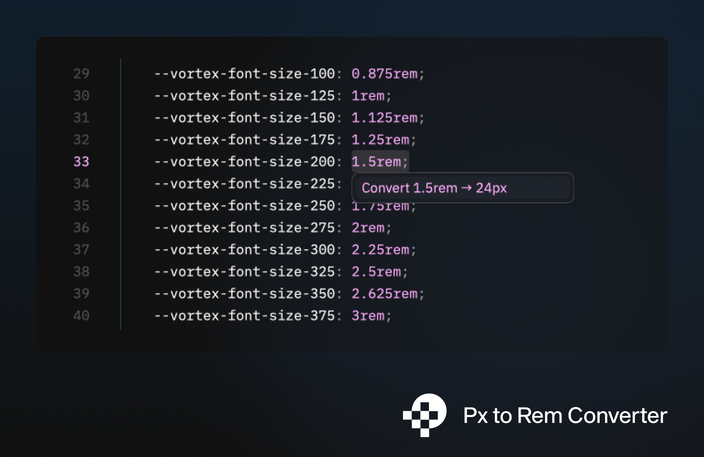

# px to rem — Zed Extension

Converts CSS `px` values to `rem` and vice versa directly in the editor.



## Usage

Place your cursor on any `px` or `rem` value and press `cmd+shift+z` to open the conversion menu. Select the conversion you want and press `enter`.

To convert multiple values at once, select a block of text first — you'll see individual actions for each match plus a **"Convert ALL"** batch option.

## Installation

### 1. Install the LSP server

Download the latest `px-to-rem-lsp` binary from the [Releases](https://github.com/ugi-dev/px-to-rem-zed/releases) page and place it somewhere on your `PATH`, for example:

```sh
cp px-to-rem-lsp /usr/local/bin/px-to-rem-lsp
chmod +x /usr/local/bin/px-to-rem-lsp
```

### 2. Install the Zed extension

In Zed, open the command palette (`cmd+shift+p`) and run:

```
zed: install dev extension
```

Point it to this directory.

## Keybinding

The default shortcut is `cmd+shift+z`. To change it, add the following to `~/.config/zed/keymap.json`:

```json
{
  "context": "Editor",
  "bindings": {
    "cmd-shift-z": "editor::ToggleCodeActions"
  }
}
```

Replace `cmd-shift-z` with any key combination you prefer. Available modifiers are `cmd`, `ctrl`, `shift`, and `alt`.

## Configuration

To change the base `px` value (default: `16`), add the following to `~/.config/zed/settings.json`:

```json
{
  "lsp": {
    "px-to-rem-lsp": {
      "initialization_options": {
        "px_per_rem": 10,
        "decimal_places": 4
      }
    }
  }
}
```

After changing these settings, restart the language server via the command palette:

```
editor: restart language server
```

| Option | Default | Description |
|---|---|---|
| `px_per_rem` | `16` | How many pixels equal 1rem |
| `decimal_places` | `4` | Max decimal places in the result |

## Supported file types

CSS, SCSS, Less, HTML, JavaScript, TypeScript

## Building from source

```sh
# Build the LSP server
cargo build -p px-to-rem-lsp --release

# Build the Zed extension (WASM)
cargo build --lib --target wasm32-wasip1 --release
```
